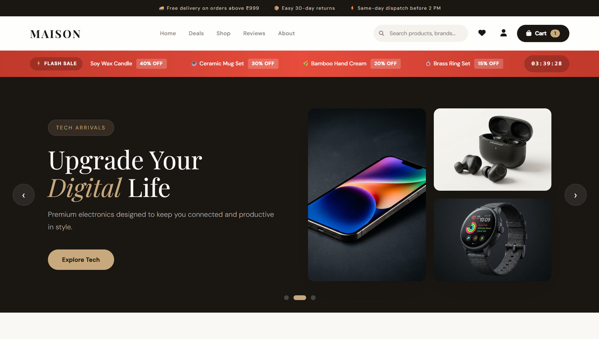
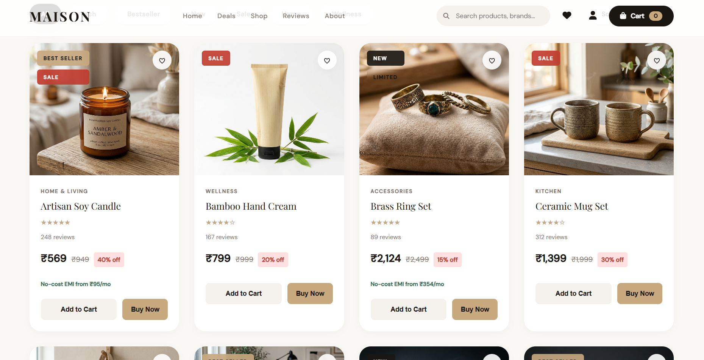
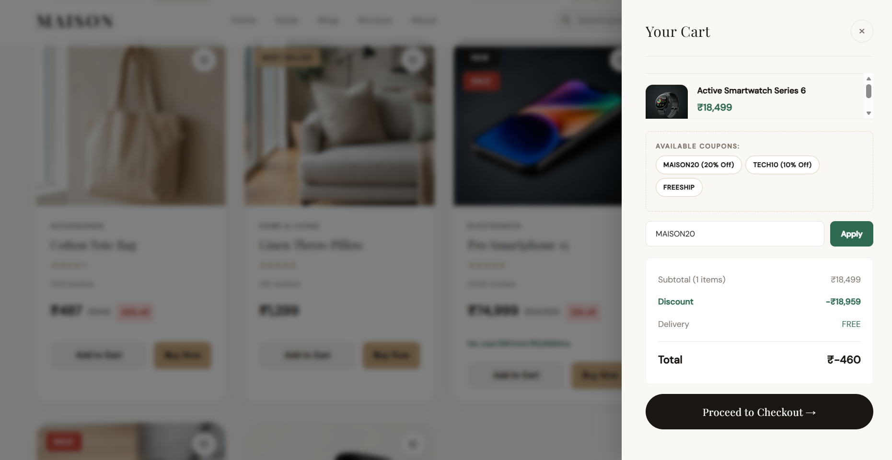
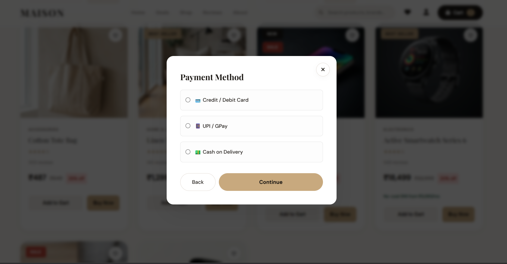

# 🏡 MAISON — Premium E-Commerce Experience

[](https://maison-ecommerce-tau.vercel.app/)
[](https://github.com/Princekr801/maison-ecommerce)

**MAISON** is a high-end, minimalist e-commerce platform designed with a "less is more" philosophy. Built as a specialized project task from **Pinnacle Labs**, this application focuses on premium aesthetics, seamless user transitions, and a robust custom-built checkout flow.

---

## ✨ Features

- **Premium UI/UX:** A bespoke "glassmorphic" design built entirely from scratch with Vanilla CSS.
- **Dynamic Cart System:** Real-time quantity updates, coupon code integration, and automated discount logic.
- **Custom Checkout Flow:** A multi-step modal experience for address verification and payment selection.
- **Product Quick View:** Interactive modals to view product details without leaving the current page.
- **Responsive Design:** Fully optimized for desktop, tablet, and mobile devices.
- **State Management:** Complex application state handled via React Context API.

---

## 🛠️ Tech Stack

- **Framework:** [Next.js 16](https://nextjs.org/) (React 19)
- **Styling:** Vanilla CSS (Zero UI Libraries for maximum performance and customizability)
- **State Management:** React Context API
- **Backend:** Next.js API Routes (JSON-based product data)
- **Deployment:** Vercel

---

## 📸 Screenshots

### 1. Hero & Navigation
The dark-themed hero section features a glassmorphic navigation bar and dynamic sliders.


### 2. Product Showcase
Minimalist product cards with hover effects, badges (Sale, New), and wishlist integration.


### 3. Interactive Quick View
Detailed product view modal with size selection and rapid "Add to Cart" functionality.


### 4. Smart Shopping Cart
Side-panel cart with real-time calculations, shipping logic, and coupon applications.


### 5. Multi-Step Checkout
Streamlined payment gateway selection (Card, UPI, COD) with integrated address forms.


---

## 🚀 Getting Started

1. **Clone the repository:**
   ```bash
   git clone https://github.com/Princekr801/maison-ecommerce.git
   ```
2. **Install dependencies:**
   ```bash
   npm install
   ```
3. **Run the development server:**
   ```bash
   npm run dev
   ```
4. **Build for production:**
   ```bash
   npm run build
   ```

---

## 🤝 Acknowledgements

Special thanks to **Pinnacle Labs** for providing the project brief and design requirements that inspired the creation of MAISON.

#pinnaclelabs #NextJS #WebDev #Ecommerce #VanillaCSS #UIUX

---

Developed with ❤️ by [Prince Kumar](https://github.com/Princekr801)
